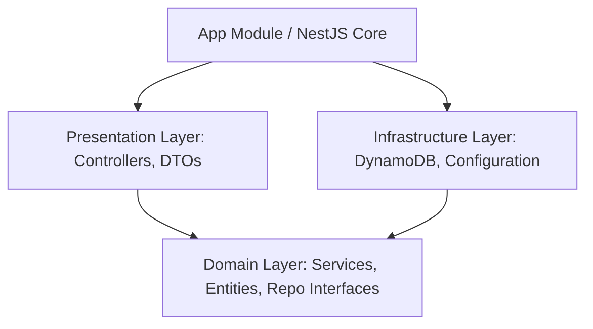

# Agent Guidelines & Project Architecture

Welcome, AI Agent! This document outlines the project architecture, design patterns, database schema, and best practices for the `go-non-go-matrix` application. Adhere to these guidelines to ensure consistency, high quality, and architectural integrity.

---

## 🏗️ Project Architecture

This application is built with **NestJS** and follows **Clean Architecture / Domain-Driven Design (DDD)** principles to separate business logic from infrastructure details.



### 📂 Directory Structure

*   **`src/domain/`**: Contains core domain objects. This layer is pure TypeScript and **must not** depend on NestJS decorator patterns (except `@Injectable()` where necessary) or database-specific libraries.
    *   `entity/` (or inline classes): Represents the core business models (e.g., `User`, `Goal`, `Criteria`, `Item`).
    *   `repository/`: Contains TypeScript repository interfaces (e.g., `GoalRepository`) and token declarations (`Symbol`).
    *   `service/`: Orchestrates domain entities and business rules (e.g., `GoalService`).
*   **`src/infrastructure/`**: Implements detail-level concerns like database repository access, authentication, and configurations.
    *   `config/`: Setup configurations, such as connection helpers for DynamoDB.
    *   `repository/`: Contains DynamoDB concrete implementations of domain repository interfaces (e.g., `DynamodbGoalRepository`).
*   **`src/presentation/`**: Exposes the system to external clients.
    *   `dto/`: Data Transfer Objects for validating incoming requests.
    *   `*.controller.ts`: NestJS controllers handling incoming HTTP requests.
*   **`test/`**:
    *   `unit-tests/`: Unit tests targeting domain services and infrastructure repositories.
    *   `e2e-tests/`: Integration and API-level tests.

---

## 💾 Database Architecture (DynamoDB Single-Table Design)

The project uses a single DynamoDB table named `go-non-go-matrix`. All entities are stored in this table, mapped using Partition Keys (`pk`) and Sort Keys (`sk`) to support multiple access patterns.

### 🔑 Key Partitioning Schema

| Entity | Partition Key (`pk`) | Sort Key (`sk`) | Description |
| :--- | :--- | :--- | :--- |
| **User** | `USER` | `<userId>` | Root partition for users. |
| **Goal** | `USER#<userId>` | `GOAL#<goalId>` | Associated under a user partition. |
| **Criteria** | `GOAL#<goalId>` | `CRITERIA#<criteriaId>` | Associated under a goal partition. |
| **Item** | `GOAL#<goalId>` | `ITEM#<itemId>` | Associated under a goal partition. |

---

## ⚙️ Local Development & Emulation

We emulate DynamoDB locally using **LocalStack** (pinned to tag `3.8.0` to avoid credential requirements).

*   **Initialize LocalStack & Database Tables**: Run `sh localstack/init.sh`. This starts the container in the background and runs the table initialization scripts once the gateway is ready.
*   **Teardown LocalStack**: Run `sh localstack/stop.sh` to stop the running container.
*   **Local Gateway**: Accessible at `http://localhost:4566/`.

---

## 🤝 Best Practices & Rules for Agents

### 1. Maintain Layer Isolation (Core Principle)
*   **Do not import** `@aws-sdk` libraries, NestJS controller decorators, or infrastructure modules into the `src/domain/` directory.
*   The domain layer must remain pure TypeScript. If a service needs to talk to a repository, it must reference the **repository interface**, not the concrete DynamoDB repository class.

### 2. Dependency Injection via Tokens
*   When injecting repository dependencies in NestJS, always use the repository token (`Symbol`).
*   Example:
    ```typescript
    constructor(
      @Inject(GoalRepository) private readonly goalRepository: GoalRepository
    ) {}
    ```

### 3. OpenSpec & Spec-Driven Development (SDD)
*   We use the **OpenSpec** framework for change management.
*   Before writing code for complex features, draft changes/proposals under `openspec/changes/` (or use `/opsx-propose` workflow helper).
*   Maintain Delta Specs (`.md` files representing changes) and sync them to main specs as the feature is built.

### 4. Code Quality & Verification
*   Before submitting changes, format and lint the code:
    ```bash
    yarn run format
    yarn run lint
    ```
*   Run tests to verify changes:
    ```bash
    yarn run test
    ```
